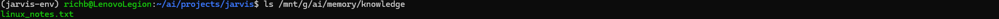
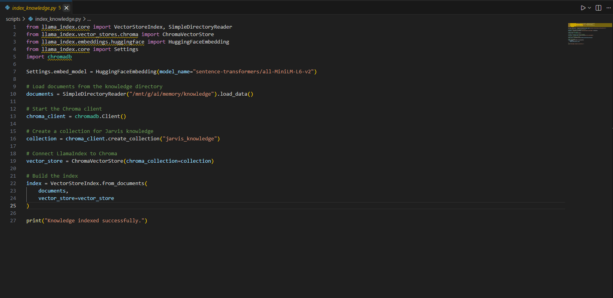
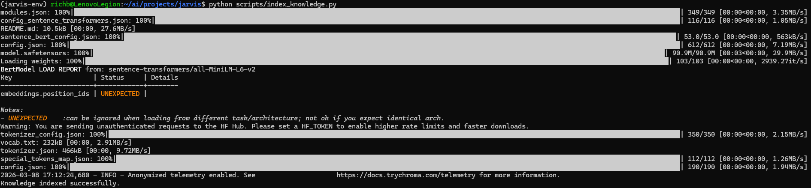

# Build Log 003 – Knowledge Layer

Date: March 2026

## Goal

Implement the Jarvis knowledge layer so the AI system can retrieve
information from local documents rather than relying only on model
training data.

This phase introduces a vector database and a document indexing
pipeline.

---

## Knowledge Architecture

The knowledge layer provides persistent memory for Jarvis.

Documents are stored locally and converted into semantic embeddings
that can be searched when the user asks a question.

Conceptual pipeline:

Document  
↓  
Chunking  
↓  
Embedding generation  
↓  
Vector storage  
↓  
Semantic retrieval  

---

## Components Used

Chroma  
Vector database used to store document embeddings.

LlamaIndex  
Framework used for document ingestion and retrieval.

Sentence Transformers  
Local embedding model used to convert text into vectors.

Embedding model used:

sentence-transformers/all-MiniLM-L6-v2

This lightweight model generates embeddings locally without requiring
external API access.

---

## Knowledge Storage Location

Knowledge documents are stored in the AI workspace:

/mnt/g/ai/memory/knowledge

### Knowledge Directory

Example file used during testing:

linux_notes.txt

This file served as the first document indexed by the system.

---

## Python Environment

A dedicated Python virtual environment was created for Jarvis runtime
services.

Environment location:

~/ai/runtime/python/jarvis-env

This environment contains all required knowledge layer dependencies.

---

## Installed Libraries

Key libraries installed for the knowledge layer:

llama-index  
chromadb  
sentence-transformers  
llama-index-vector-stores-chroma  
llama-index-embeddings-huggingface  

These packages allow Jarvis to ingest documents, generate embeddings,
and store them in the vector database.

---

## Indexing Script

A document indexing script was created.

Location:

scripts/index_knowledge.py

### Indexing Script

Purpose of the script:

1. Load documents from the knowledge directory
2. Convert text into embeddings
3. Store embeddings in the Chroma vector database

---

## Embedding Configuration

The system was configured to use a **local embedding model** rather
than OpenAI embeddings.

Configuration added to the indexing script:

Settings.embed_model = HuggingFaceEmbedding(
    model_name="sentence-transformers/all-MiniLM-L6-v2"
)

This ensures the system operates completely offline.

---

## Indexing Execution

The indexing pipeline was executed with:

python scripts/index_knowledge.py

### Successful Knowledge Indexing

During execution:

1. The embedding model was downloaded from HuggingFace
2. The document was chunked
3. Embeddings were generated
4. The embeddings were stored in the Chroma database

Successful output:

Knowledge indexed successfully.

---

## Current System Capabilities

Jarvis can now:

• store documents as semantic embeddings  
• retrieve information from local knowledge sources  
• support retrieval-augmented generation (RAG)

This allows the AI system to answer questions based on the owner's
documents and notes.

---

## Architectural Impact

The Jarvis architecture now includes a functioning knowledge layer.

Current stack:

Interface Layer  
↓  
Logic Layer  
↓  
Knowledge Layer (Chroma + LlamaIndex)  
↓  
AI Runtime Layer (Ollama)

---

## Future Improvements

Planned enhancements to the knowledge system:

• automated document ingestion  
• indexing of GitHub repositories  
• log file indexing  
• homelab documentation integration  
• internet search integration  
• multi-source knowledge retrieval

---

## Next Phase

The next development phase will begin construction of the **logic
layer**.

This layer will route user requests to the appropriate system
capability such as:

• knowledge retrieval  
• system diagnostics  
• internet search  
• home automation