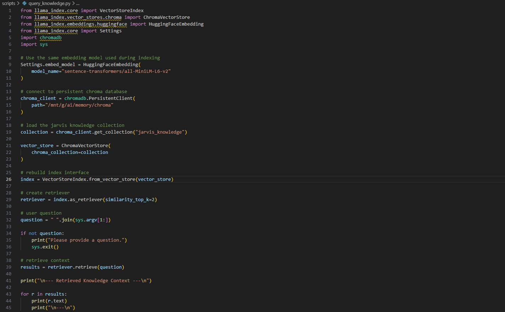
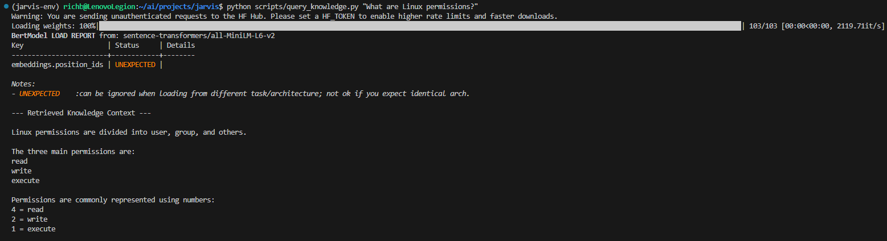
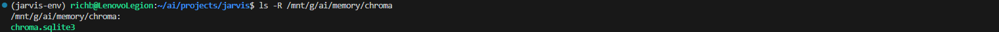

# Build Log 004 – Knowledge Retrieval

Date: March 2026

## Goal

Implement the first retrieval tool for the Jarvis knowledge system.

Previous work in Build Log 003 created the knowledge layer, including
the vector database and document indexing pipeline.

This phase focuses on retrieving relevant information from that
database so Jarvis can use locally stored knowledge during queries.

The retrieval tool will later become a core component of the Jarvis
logic layer.

---

## Knowledge Retrieval Concept

The Jarvis knowledge system follows a retrieval augmented generation
(RAG) architecture.

Documents are first indexed and stored as semantic embeddings inside
a vector database.

When a user asks a question, the system converts that question into an
embedding and searches the vector database for the most semantically
similar pieces of text.

Conceptual flow:

User question  
↓  
Embedding generation  
↓  
Vector similarity search  
↓  
Relevant document chunks returned  

These retrieved text chunks can then be supplied to the AI model as
context when generating responses.

---

## Retrieval Tool Implementation

A retrieval script was created to allow Jarvis to search the local
knowledge database.

Script location

```
scripts/query_knowledge.py
```

Screenshot



Purpose of the tool

• accept a user question  
• convert the question to an embedding  
• perform semantic similarity search against the Chroma vector database  
• return the most relevant document chunks  

Example command

```
python scripts/query_knowledge.py "What are Linux permissions?"
```

---

## Verification

The retrieval tool was tested by querying the local knowledge database.

Example command and output



The query successfully returned relevant context from the indexed
documents, confirming that semantic retrieval from the Chroma database
is functioning correctly.

The persistent vector database used by the knowledge system is located
in the AI workspace.

Screenshot



Database location

```
/mnt/g/ai/memory/chroma
```

The collection used by the Jarvis knowledge system is:

```
jarvis_knowledge
```

The retriever currently returns the two most similar document chunks
for each query.

```
similarity_top_k = 2
```

---

## Current System State

Jarvis can now:

• index local documents  
• store semantic embeddings in a persistent vector database  
• retrieve relevant document context from local knowledge sources  

This completes the knowledge retrieval capability required before
building the Jarvis logic layer.

---

## Next Phase

The next development phase will begin construction of the **Jarvis
logic layer**.

This layer will act as the routing and orchestration system for the
Jarvis AI platform.

Responsibilities will include:

• interpreting user requests  
• determining which system capability should be used  
• routing requests to the appropriate tools  
• assembling context for the AI model  
• returning responses to the interface layer