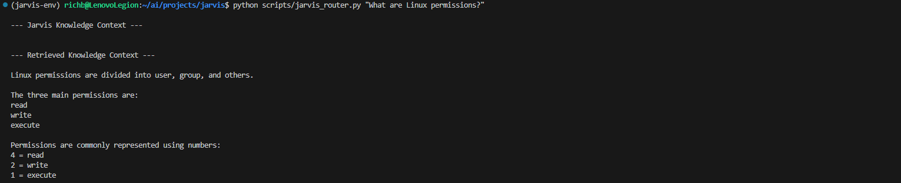
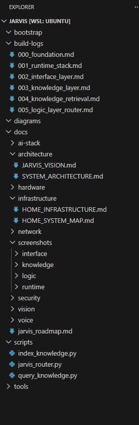

# Build Log 005 – Initial Logic Layer Router

Date: March 2026

## Goal

Begin implementation of the **Jarvis Logic Layer**.

The logic layer functions as the orchestration system for Jarvis.  
It receives requests from the interface layer and determines which
system capability should handle the request.

This phase introduces the **first routing component** for the system.

---

# Logic Layer Concept

The Jarvis architecture separates system responsibilities into layers.

Interface Layer  
↓  
Logic Layer  
↓  
Knowledge Layer  
↓  
AI Runtime Layer  

The **Logic Layer** is responsible for coordinating these systems.

Primary responsibilities include:

• interpreting user requests  
• determining system intent  
• selecting the appropriate tool  
• retrieving required data  
• assembling context for the AI model  

This layer will eventually coordinate multiple system capabilities.

Examples include:

• knowledge retrieval  
• system diagnostics  
• internet search  
• home automation  
• external AI models  

---

# Router Implementation

The first component of the logic layer is the **Jarvis Router**.

Script location:

[scripts/jarvis_router.py](../scripts/jarvis_router.py)

This script acts as the **initial entry point** for user requests.

Responsibilities of this component:

• accept a user request  
• perform basic rule-based intent detection  
• route knowledge-style queries to the knowledge retrieval tool  
• return retrieved context from the vector database  

For this initial implementation, intent detection is intentionally
simple and keyword-based.

Future versions will expand routing capabilities and support
multiple system tools.

---

# Current Routing Flow

The routing pipeline introduced in this phase operates as follows.

User request  
↓  
Jarvis Router  
↓  
Knowledge Retrieval Tool  
↓  
Chroma Vector Database  
↓  
Retrieved document context  

This confirms that the logic layer can successfully orchestrate the
knowledge system.

---

# Verification

The router was tested using the following command.

```
python scripts/jarvis_router.py "What are Linux permissions?"
```

Screenshot



The system successfully routed the request to the knowledge retrieval
tool and returned relevant document chunks from the vector database.

This confirms that:

• the router correctly interprets requests  
• the retrieval tool executes successfully  
• the Chroma vector database returns relevant knowledge  

---

# Repository Structure

The following screenshot shows the Jarvis repository structure after
adding the initial logic layer router.

Screenshot



Key directories involved in this phase include:

scripts  
build-logs  
docs/screenshots/logic  

The router script resides within the **scripts directory**, which
contains executable components of the Jarvis system.

---

# Architectural Impact

This milestone introduces the **first operational component of the
Jarvis Logic Layer**.

The current system architecture now includes:

Interface Layer  
↓  
Logic Layer (initial router)  
↓  
Knowledge Layer (Chroma + LlamaIndex)  
↓  
AI Runtime Layer (Ollama)

The router will eventually evolve into the **central orchestration
system** for all Jarvis capabilities.

---

# Future Logic Layer Responsibilities

As development continues, the logic layer will expand to support
additional capabilities including:

• multi-tool request routing  
• AI prompt context assembly  
• system diagnostics tools  
• internet search integration  
• home automation commands  
• perception system integration  

This layer will become the **control center of the Jarvis AI platform**.

---

# Next Phase

The next development step will add **context assembly** to the logic
layer.

This will allow Jarvis to:

• retrieve relevant knowledge  
• construct structured prompts  
• supply context to the AI model  
• generate responses based on local documents  

This step will transform the system from a **vector search tool** into
a fully functional **retrieval augmented generation (RAG) AI assistant**.