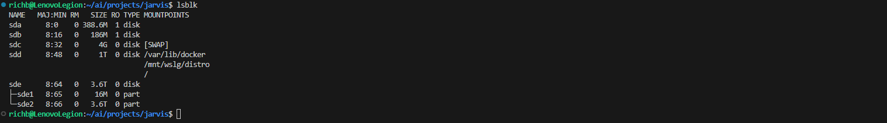
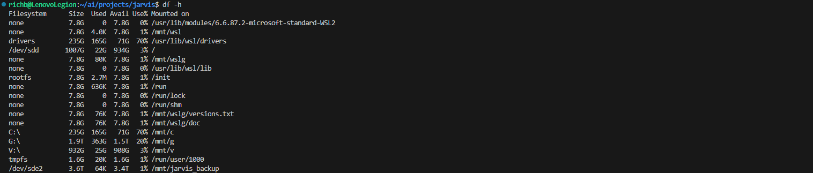

# Build Log 007 – Backup and Rebuild Foundations

Date: March 2026

---

## Objective

Establish a long-term backup and archival storage system for the Jarvis infrastructure.

The goal of this phase is to prepare a dedicated external disk that will serve as the **long-term memory and backup vault** for the Jarvis system.

This disk will eventually support:

- Jarvis repository backups
- AI workspace backups
- vector database backups
- documentation archives
- long-term cold storage of inactive data
- rebuild/bootstrap scripts for disaster recovery

The long-term objective is to enable Jarvis infrastructure to be **reproducible**, meaning the entire system can be restored onto new hardware using backups and rebuild scripts.

---

# External Backup Disk Preparation

## Initial State

A 4TB external Seagate Expansion drive was connected to the system.

Inspection through Windows Disk Management revealed the disk was using an **MBR partition layout**, which is not ideal for modern large disks.

Because the drive was essentially empty, the decision was made to **wipe the partition table and rebuild the disk from scratch using GPT**.

This provides a clean foundation for Linux filesystems and future infrastructure growth.

---

## Disk Reset

The Windows `diskpart` utility was used to wipe the existing partition structure.

Commands used:

```
diskpart
list disk
select disk 3
clean
convert gpt
exit
```

This operation removed all existing partitions and converted the disk to a **GPT partition table**, leaving the entire disk unallocated.

---

## Attaching the Disk to WSL

The disk was attached to the WSL environment using:

```
wsl --mount \\.\PHYSICALDRIVE3
```

This exposes the raw disk device directly to the Linux kernel running inside WSL.

Once attached, the disk appeared inside Linux as `/dev/sde`.

---

## Partition Creation

A Linux partition was created using `fdisk`.

```
sudo fdisk /dev/sde
```

A new partition (`sde2`) was created using the remaining space on the disk.

The disk layout after partitioning:



---

## Filesystem Creation

The partition was formatted using the EXT4 filesystem.

```
sudo mkfs.ext4 -L jarvis_backup /dev/sde2
```

EXT4 was chosen because it is stable, well-supported, and appropriate for long-term Linux infrastructure storage.

---

## Mount Point Creation

A mount point was created for the archive vault.

```
sudo mkdir -p /mnt/jarvis_backup
```

The disk was then mounted manually.

```
sudo mount /dev/sde2 /mnt/jarvis_backup
```

Mount verification:



---

## Automatic Mount Configuration

To ensure the disk mounts automatically when WSL starts, an entry was added to `/etc/fstab`.

```
UUID=6ea75700-71e2-4ff7-a90f-4a9a7aa63e7d /mnt/jarvis_backup ext4 defaults 0 2
```

This ensures the archive vault is always available at:

```
/mnt/jarvis_backup
```

---

# Backup Vault Directory Structure

Once the disk was mounted, the initial archive directory structure was created.

```
sudo mkdir -p /mnt/jarvis_backup/{archive,backups,repos,rebuild,snapshots}
```

The archive directory was further subdivided into storage categories.

```
sudo mkdir -p /mnt/jarvis_backup/archive/{models,knowledge,workspace,logs}
```

Current directory structure:


---

# Directory Purpose

archive/  
Cold storage tier for data that is no longer actively used.

Examples include:

- archived models
- old workspace projects
- archived vector databases
- historical logs

backups/  
Primary backup copies of important system data.

repos/  
Local mirrors of Git repositories and exported project code.

snapshots/  
Point-in-time snapshots of important directories such as the AI workspace.

rebuild/  
Infrastructure scripts and documentation required to rebuild the Jarvis system from scratch.

---

# Storage Architecture Concept

Jarvis now operates with **tiered storage**.

Hot Storage (NVMe)

```
/mnt/g/ai
```

Cold Storage (Archive Vault)

```
/mnt/jarvis_backup/archive
```

Future automation scripts will eventually move inactive data from the NVMe workspace into the archive vault when it has not been accessed for an extended period.

This keeps the NVMe fast and uncluttered while preserving long-term history.

---

# Notes for Future Jarvis Development

The archive vault created in this phase forms the **long-term memory layer** of the Jarvis system.

Future phases may introduce:

- automated snapshot scripts
- scheduled backup jobs
- cold storage lifecycle automation
- archive restoration workflows
- full infrastructure rebuild scripts

With this disk in place, Jarvis infrastructure can now survive hardware failure through **reproducible rebuilds using archived data and repository history**.

---

# Current System State

Jarvis now includes:

Interface Layer  
Logic Layer  
Knowledge Layer  
AI Runtime Layer  
Archive Vault Storage Layer

The system now has a dedicated **3.6TB archive disk** for backups, cold storage, and infrastructure recovery.