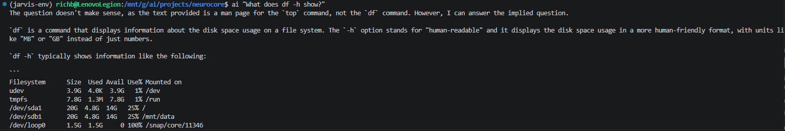
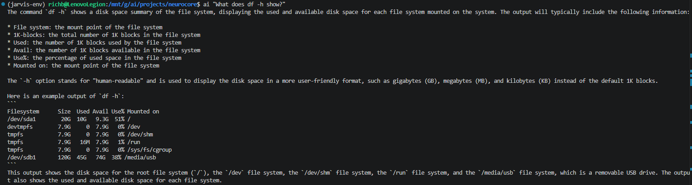

# Build Log 013 – RAG Metadata and Grounded Retrieval

Date: April 2026

## Objective

Up to this point, NeuroCore had a basic knowledge system in place, but it wasn’t reliable.

The system could retrieve documents, but:

- retrieval was inconsistent  
- responses were still driven by the model instead of the data  
- unrelated commands would leak into answers  

The goal for this phase was to fix that and turn RAG into something **accurate and trustworthy**, not just “working.”

---

## System State Before This Phase

The system had:

- document ingestion  
- Chroma vector store  
- retrieval wired into the router  

But behavior looked like this:

- `df` queries sometimes returned `top` or `ps` content  
- responses were often generic  
- model ignored retrieved context when it felt like it  

Example:

At this point, RAG technically existed, but it wasn’t usable.

---

## Root Problem

The issue was not embeddings or storage.

The real problem:

- documents had **no identity**  
- retrieval was purely similarity-based  
- system had no concept of “this belongs to df vs top vs ps”  

So even with good data, retrieval was noisy.

---

## Solution – Metadata-Based Retrieval

Instead of trying to “improve similarity,” the system was upgraded to:

> **filter first, then search**

---

## Step 1 – Metadata Added During Indexing

Each document is now tagged based on its file path:

Example:

    /linux/filesystems/df.txt

Becomes:

    command = df  
    category = filesystems  

This is done automatically during indexing.

---

## Step 2 – Clean Vector Store Rebuild

The Chroma database was wiped and rebuilt to ensure:

- no leftover embeddings  
- no test data contamination  
- clean alignment between indexing and retrieval  

Collection name standardized:

    jarvis_knowledge

---

## Step 3 – Metadata-Aware Retrieval

Retrieval logic was updated to:

1. detect command from query  
2. filter documents by metadata  
3. run similarity search only within that subset  

Example:

    "What does df -h show?"

Now searches only:

    command = df

This completely eliminates cross-command contamination.

---

## Step 4 – Prompt Grounding Enforcement

The router prompt was upgraded to force the model to use retrieved context:

- no relying on pretraining unless necessary  
- no hallucinated details  
- must base answer on provided context  

This ensures RAG is actually used, not ignored.

---

## Step 5 – Output Quality Improvements

Adjusted generation behavior:

- increased token limit (`num_predict`)  
- enforced complete explanations instead of short answers  

---

## First Successful Result

After these changes, retrieval became precise and grounded.

Example:

Behavior changed from:

- generic answers  
→ to  
- correct, command-specific explanations  

---

## Final System Behavior

### Before

- RAG present but unreliable  
- model dominated responses  
- incorrect document mixing  

---

### After

- command-aware retrieval  
- clean document isolation  
- grounded responses using real data  
- consistent behavior  

---

## Current System Architecture

    CLI
    ↓
    UNIX Socket (/tmp/neurocore.sock)
    ↓
    NeuroCore Daemon
    ↓
    Runtime Manager
    ↓
    Router (with context injection)
    ↓
    Knowledge System (Chroma + metadata)
    ↓
    LLM (Ollama)
    ↓
    Response

---

## Outcome

NeuroCore now has a **fully functional, grounded RAG system**.

The system no longer guesses when answering technical questions.

It retrieves the correct documentation and uses it to generate responses.

This is the point where NeuroCore transitions from:

> “LLM with documents”

to:

> **knowledge-backed system**

---

## Key Insight

RAG is not just about indexing documents.

It requires:

- structured data (metadata)  
- controlled retrieval  
- enforced grounding  

Without all three, the system falls back to model behavior.

---

## Next Step – Session Memory

Current behavior:

- each query is independent  
- no conversation awareness  

Next goal:

introduce session memory so NeuroCore can:

- maintain context across queries  
- support multi-turn reasoning  
- behave like a persistent assistant  

---

## Summary

This phase fixed the most important weakness in the system.

NeuroCore now retrieves the **right information** and uses it correctly.

This marks a major transition from experimental system to reliable tool.