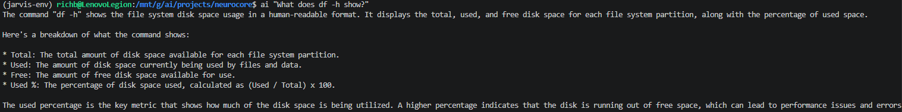
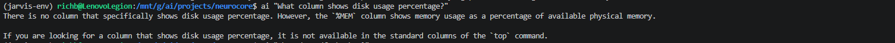
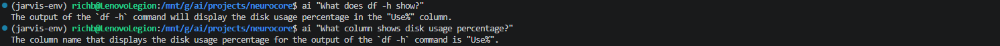

# Build Log 014 – Session Memory, Query Rewriting, and Knowledge Correction

Date: April 2026

## Objective

At this point, NeuroCore had already reached a major milestone.

The system now had:

- a persistent daemon  
- a streaming CLI  
- a knowledge layer backed by Chroma  
- metadata-based RAG  
- grounded retrieval for direct command questions  

But it was still behaving like a mostly stateless system.

It could answer direct questions about commands such as:

    What does df -h show?

but it still struggled with natural follow-up questions such as:

    What column shows disk usage percentage?

The goal of this phase was to fix that.

The target was not just memory for the sake of memory.  
The real goal was:

- preserve conversational context  
- resolve ambiguous follow-up questions  
- retrieve the correct command-specific knowledge  
- return exact field names from actual CLI-oriented knowledge  

This phase ended up solving one of the hardest problems so far:

> making NeuroCore behave like a system that understands what is being discussed, not just a model that answers one prompt at a time

---

## System State Before This Phase

Before this work, NeuroCore had a working RAG pipeline and could answer direct technical questions with much better accuracy than earlier builds.

The problem was that follow-up questions still broke down.

A question like:

    What does df -h show?

would often work.

But a follow-up like:

    What column shows disk usage percentage?

could go off the rails and produce answers based on unrelated command output such as:

- `top`
- `ps`
- `%MEM`
- process statistics instead of filesystem statistics

This was not just a weak answer problem.

It was a deeper system issue involving:

- conversational context not being resolved correctly  
- ambiguous follow-up questions being treated in isolation  
- retrieval falling back into the wrong command domain  
- raw man page terminology leaking into answers  

### Example – Before Fix

At this point, RAG was functioning, but context-aware reasoning was not reliable.

---

## Root Problems Identified

This phase uncovered several separate problems that were interacting with each other.

---

### Problem 1 – No Real Session Memory

The first issue was simple:

NeuroCore was still mostly treating each query like a fresh request.

Even though the user was clearly asking a follow-up question, the system was not preserving enough conversational state to reliably understand what “it” referred to.

That meant a follow-up like:

    What column shows disk usage percentage?

was not strongly tied to the prior discussion of `df -h`.

Without that connection, the system had to guess.

---

### Problem 2 – Follow-Up Questions Needed Rewriting

Even with session history available, the model still had to answer an ambiguous question.

This is the same problem a human would have if somebody walked into the room and just asked:

    What column shows disk usage percentage?

The correct interpretation depends entirely on prior context.

So the system needed a way to convert follow-up questions into fully self-contained technical questions before retrieval.

Example:

    What column shows disk usage percentage?

needed to become something closer to:

    What column in df -h output shows disk usage percentage?

Without that rewrite step, retrieval remained vulnerable to ambiguity.

---

### Problem 3 – Cross-Command Contamination in Retrieval

Another major issue was that retrieval was still capable of pulling the wrong command domain into the answer.

In earlier tests, a `df` question could still pick up pieces of `top` or `ps` knowledge.

This happened because retrieval was not always constrained tightly enough to the intended command context.

The result was a very specific kind of bad behavior:

- a disk usage question would retrieve memory or process information  
- a follow-up question would drift into `%MEM` or process output fields  
- the model would answer with confidence, but in the wrong domain  

This was one of the most important problems fixed in this phase.

---

### Problem 4 – Raw Documentation Was Not the Same as Operational Knowledge

This phase also exposed a more subtle issue:

raw man page content is not always the same thing as usable operational knowledge.

A good example was `df`.

The raw documentation included internal field naming like:

    pcent

but the actual CLI-facing column shown to the user is:

    Use%

Once the prompt was strengthened to “use exact names from context,” the model began returning the wrong-but-documented internal terminology.

That was an important lesson:

> the system was now working correctly enough that bad source formatting became the bottleneck

At this point, the problem was no longer architecture.

It was knowledge quality.

---

## Step 1 – Session Memory Added

The first major change in this phase was the introduction of persistent session memory.

A new memory location was created outside the repo:

    /mnt/g/ai/memory/sessions/richard/session.json

This was the correct design choice because it keeps memory:

- outside version control  
- local-first  
- inspectable  
- easy to back up  
- future-proof for multi-user support  

A new module was added:

    scripts/session_memory.py

Responsibilities of this module:

- load recent conversation history  
- save completed interactions  
- trim memory to a small rolling window  
- keep memory readable as JSON  

The first implementation intentionally used a small rolling window instead of trying to build a full long-term memory system immediately.

That was a technical design choice, not a limitation.

The goal was to establish a clean memory spine first, then build more advanced behavior later on top of it.

---

## Step 2 – Router Integration

Once session memory existed, it had to be integrated into the router.

The router was updated so that:

- recent history could be loaded before answering  
- completed responses could be written back into session memory after generation  
- both non-streaming and streaming paths remained compatible with the rest of the runtime  

This part had to be done carefully because the runtime still expected:

    run_query

to exist as an import target.

At one point during iteration, that function was lost from the file, which caused the daemon to fail on startup with an import error.

That issue was fixed by restoring a fully compatible router implementation instead of patching around it.

That mattered because the goal was not just to “make it run again.”

The goal was to keep the architecture stable and clean.

---

## Step 3 – Query Rewriting Added

Once memory was being stored, the next problem was interpretation.

The system still needed a way to turn vague follow-up questions into self-contained technical queries.

To solve that, a query rewriting step was added to the router.

New behavior:

1. load most recent session interaction  
2. use that history to rewrite the follow-up question  
3. pass the rewritten question into retrieval  
4. answer using the rewritten question and retrieved context  

This was a major step forward because it changed the system from:

    ask → answer

to:

    interpret → retrieve → answer

That is a very different kind of architecture.

It is also much closer to how a real assistant should work.

---

## Step 4 – Retrieval Alignment Stabilized

Even after memory and rewriting were added, the system still needed better command-level discipline.

This phase reinforced metadata-aware retrieval so that the system could stay in the correct command domain.

This helped eliminate cases where:

- `df` questions pulled in `ps` or `top`
- disk usage questions produced memory-field answers
- follow-up reasoning drifted into unrelated technical areas

This was a major practical win because once retrieval is contaminated, no prompt can fully save the answer.

The model will simply answer from the wrong evidence.

This phase pushed retrieval much closer to deterministic behavior.

---

## Step 5 – Knowledge Base Correction

Once the pipeline was behaving correctly, the next failure surfaced in the data itself.

The `df` documentation was still too raw.

It included internal field names and did not clearly represent the user-facing structure of the actual command output.

That meant the system could now retrieve the right document, interpret it correctly, and still produce an answer that was technically grounded but operationally wrong.

To fix that, the `df.txt` knowledge entry was normalized into a clean operational document.

It was rewritten to include:

- command description  
- common usage  
- example output shape  
- actual displayed column names  
- exact statement that `Use%` is the column showing disk usage percentage  

This was one of the most important insights of the entire build:

> raw documentation is not always the best form of AI knowledge

What the model needs is not just “true” documentation.  
It needs documentation structured in a way that supports the task being asked.

---

## Troubleshooting Along the Way

This phase involved a lot of iteration because each fix revealed the next real bottleneck.

That was actually a good sign.

It meant the system was maturing.

A rough progression of failures looked like this:

### Early Stage
- follow-up questions interpreted in isolation  
- no real session continuity  

### After Memory Injection
- history was present, but not strong enough to guide retrieval  

### After Rewrite Layer
- command domain improved, but retrieval could still drift  

### After Retrieval Tightening
- system stayed on `df`, but raw documentation caused bad field names  

### Final Stage
- cleaned knowledge + memory + rewrite + retrieval all aligned  

At the end of the phase, the answer finally became:

    The column name that displays the disk usage percentage for the output of the df -h command is "Use%".

That was the win.

Not because it is a complicated answer, but because it proved the system was now:

- remembering context  
- rewriting the question correctly  
- retrieving the right domain  
- using the correct document  
- returning the exact user-facing field name  

That is a real systems milestone.

---

## Final Result

After these changes, NeuroCore became much more reliable in multi-turn technical conversations.

### Example – Final Correct Behavior

At this point, the system could:

- remember recent context  
- resolve ambiguous follow-up questions  
- preserve command domain correctly  
- return exact operational field names  
- stay grounded in corrected knowledge  

---

## Final System Behavior

### Before

- follow-up questions were unreliable  
- retrieval could drift into unrelated commands  
- answers could mix memory, process, and filesystem concepts  
- raw man page terminology leaked into user-facing output  

### After

- session context preserved across queries  
- follow-up questions rewritten into self-contained technical questions  
- retrieval aligned to the correct command domain  
- operational knowledge returned exact CLI-facing field names  
- answers became consistent and reliable  

---

## Architecture Update

This phase introduced a more advanced reasoning pipeline:

    User Query
    ↓
    Session Memory
    ↓
    Query Rewriting
    ↓
    Metadata-Aware Retrieval
    ↓
    Knowledge Correction / Clean Operational Context
    ↓
    LLM (Ollama)
    ↓
    Response
    ↓
    Memory Update

This is a meaningful architectural upgrade.

The system is no longer just retrieving context.

It is interpreting the conversation before retrieval and preserving state after response.

---

## Key Insight

This phase exposed one of the most important truths in AI system design so far:

> reliable behavior comes from alignment between memory, retrieval, and knowledge quality

Any one of those layers being weak causes failure.

This phase worked because all three were improved together:

- memory gave context  
- rewriting removed ambiguity  
- retrieval stayed in the right command domain  
- corrected knowledge returned the right operational terms  

---

## Outcome

NeuroCore is now:

- context-aware  
- memory-enabled  
- retrieval-controlled  
- much more reliable in follow-up questioning  

This marks the transition from:

> grounded single-query system

to:

> context-aware reasoning system

That is a major step forward.

---

## Next Step

Tool Execution Layer

Goal:

- run real system commands  
- analyze live system output  
- move from explanation → action  

This is the next major jump.

Up to now, NeuroCore has been getting better at understanding.

Next, it needs to start doing.

---

## Summary

This phase solved one of the hardest problems in the build so far.

Not raw model output.  
Not simple retrieval.  
Not direct question answering.

This phase solved:

- conversational continuity  
- ambiguous follow-up resolution  
- domain-correct retrieval  
- exact operational answers  

NeuroCore now behaves much more like a system that understands what is being discussed.

That is a major milestone.