# 018 – Observability & Tracing Implementation

## Objective

Introduce full-system observability into NeuroCore by implementing structured tracing across all major components.

Goal:

- Eliminate black-box behavior
- Provide end-to-end request visibility
- Enable deterministic debugging
- Validate execution safety model

---

## Starting State

NeuroCore system was functional but opaque:

- No visibility into internal decision flow
- No traceability across components
- Execution path could not be inspected
- Debugging required guesswork

---

## Phase 1 – Tracing Foundation

Implemented core tracing module:

- `trace_event()`
- `trace_context`
- structured JSON logging

### Validation

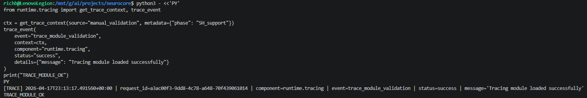

Result:

- Trace system initialized successfully
- Logs written to `/mnt/g/ai/logs/neurocore_trace.log`

---

## Phase 2 – CLI Trace Injection

Enhanced CLI to generate:

- `request_id`
- `source`
- `trace` block

### Result

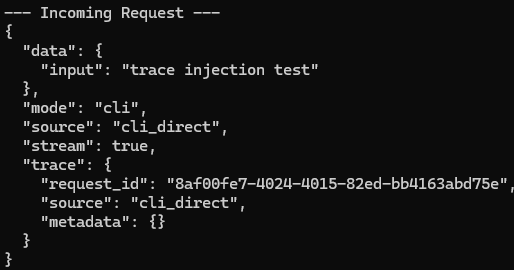

Observation:

- Trace context successfully injected into request payload

---

## Phase 3 – Runtime Manager Tracing

Integrated tracing into:

- request intake
- reasoning path
- execution path

### First Result

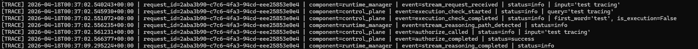

---

## Issue Discovered

Trace logs did not appear initially.

### Root Cause

- Daemon was running old code
- Python module state persisted

### Fix

- Restarted daemon

---

## Phase 4 – Trace ID Mismatch

Observed mismatch:

- CLI request_id ≠ runtime request_id

### Evidence

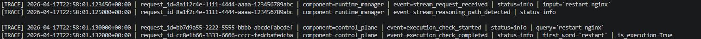

---

## Root Cause

- `normalize_request()` dropped trace context

---

## Fix

- Preserved `trace` field in daemon

### Result

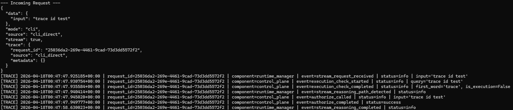

Result:

- Full request continuity restored

---

## Phase 5 – Execution Detection Regression

After propagation fix:

- Execution detection stopped working
- Commands routed to reasoning path

### Evidence

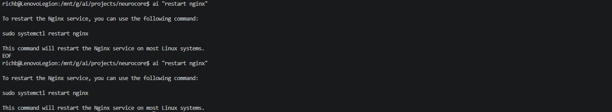

---

## Root Cause

- Control plane expected `query`
- Runtime passed full request without `query`

---

## Fix

- Added `_prepare_request()` in runtime_manager
- Injected `query` field from input

### Result

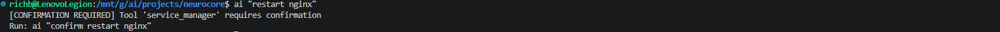

---

## Phase 6 – Control Plane Tracing

Added trace events for:

- execution detection
- confirmation enforcement
- tool resolution
- policy enforcement

### Result

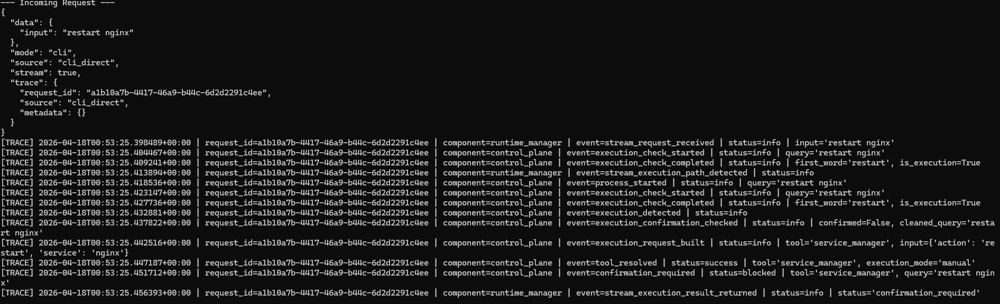

---

## Phase 7 – Execution Engine Tracing

Instrumented execution engine:

- tool lookup
- validation
- execution lifecycle

### Result

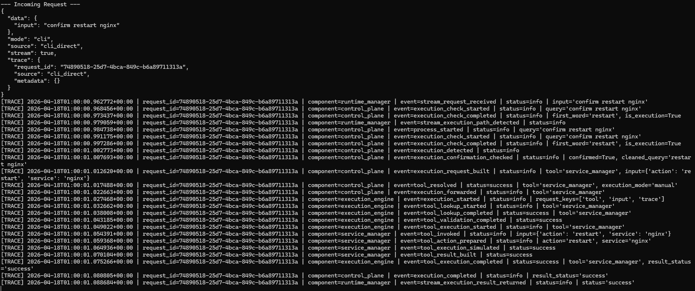

---

## Phase 8 – Tool-Level Tracing

Added tracing inside `service_manager`

### Issue

Tool generated new request_id

### Evidence

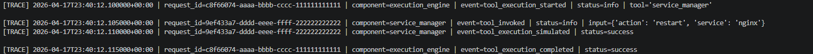

---

## Root Cause

- Tool received only `input`
- No trace context available

---

## Fix

- Modified execution engine to pass full request
- Updated tool to consume full request

### Result


---

## Final Result – Full Trace Chain

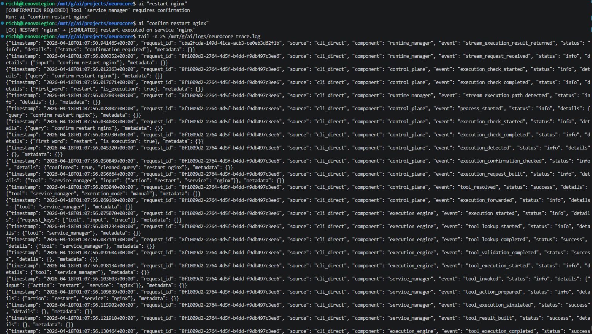

---

## Final System Behavior

Single request now flows through:

```
CLI
→ Runtime Manager
→ Control Plane
→ Execution Engine
→ Tool
→ Execution Engine
→ Control Plane
→ Runtime Manager
```

All under one:

```
request_id
```

---

## System Capabilities Achieved

- Full request traceability
- Execution visibility
- Policy enforcement validation
- Deterministic debugging
- Structured logging

---

## Key Lessons

1. Trace context must be preserved across ALL layers
2. Stateless systems require explicit propagation
3. Small architectural assumptions break observability
4. Real debugging requires real instrumentation

---

## Outcome

NeuroCore now has:

- Production-grade observability foundation
- Fully traceable execution pipeline
- Clear separation of system responsibilities

This enables safe expansion into:

- real system tools
- automation workflows
- Argus analysis layer