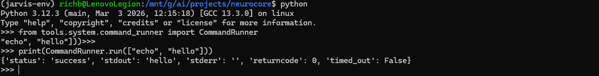
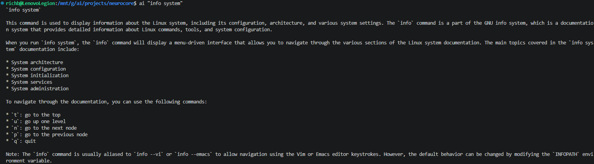
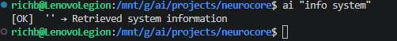
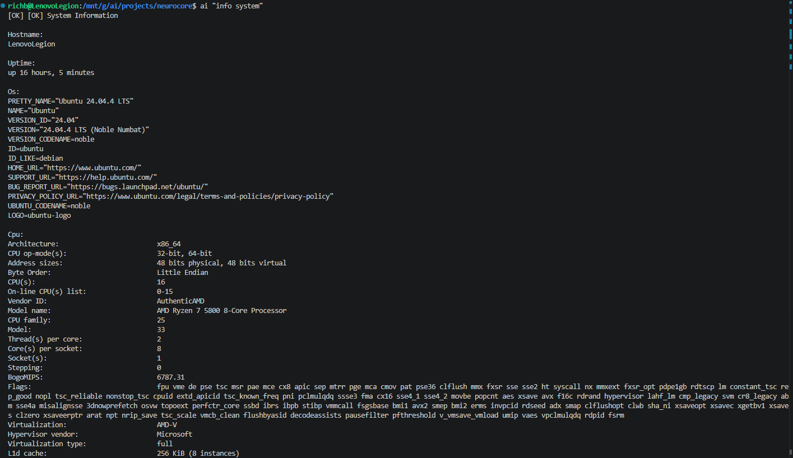
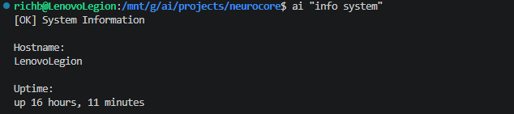

# 019 – Real Tool Execution & System Information Integration

## Objective

This phase was about crossing an important line for NeuroCore:

Moving from simulated tools to real system interaction.

Up to this point, the execution pipeline existed and worked structurally, but nothing was actually touching the system. Everything was still “safe” and simulated. The goal here was to change that—carefully—without breaking the architecture that’s already in place.

---

## Starting State

Coming into this phase, NeuroCore already had:

- Control plane enforcing execution decisions  
- Execution engine routing tool calls  
- A simulated tool (`service_manager`)  
- Full tracing across the system  

So the structure was solid.

What was missing was simple:

- No real command execution  
- No real system data  
- No proof that the pipeline works end-to-end under real conditions  

---

## 1. CommandRunner – First Real Execution Layer

The first step was introducing a proper execution primitive:

```
tools/system/command_runner.py
```

This handles:

- subprocess execution  
- stdout / stderr capture  
- return codes  
- timeout enforcement (10 seconds)  

Nothing fancy here—just something reliable that everything else can build on.

---

### Validation



Ran a simple test command to confirm:

- Commands execute correctly  
- Output comes back clean  

At this point, we know we can safely run system commands from inside NeuroCore.

---

## 2. SystemInfo Tool – First Real Tool

With execution working, next step was building the first real tool:

```
tools/system/system_info.py
```

Initial scope:

- hostname  
- uptime  
- OS info  
- CPU info  
- memory  
- disk  

Execution mode:

```
auto (read-only)
```

This was intentional—low risk, high signal.

---

## 3. First Attempt – Wrong Path

First run:

```
ai "info system"
```

Did not go as planned.



Instead of executing, it went down the reasoning path.

### What happened

The control plane didn’t recognize `"info"` as something that should trigger execution.

So the system did exactly what it was designed to do—it just wasn’t told about this new behavior yet.

---

## 4. Fix – Control Plane Routing

Updated the control plane to recognize:

```
info → system_info
```

Now the request flows correctly:

```
control_plane → execution_engine → system_info
```

---

## 5. Output Formatting Issue

Next problem showed up right away.



Execution was happening, but the output didn’t look right.

### Why

The runtime formatter was still expecting:

```
action / service
```

That worked for `service_manager`, but not for a data-driven tool like `system_info`.

So now we had a mismatch between tool output and UI expectations.

---

## 6. CLI Output Breaks Completely

Then things broke a bit harder.


Output looked like this:

```
statusresponseerror
```

At that point, it was clear this wasn’t just formatting—it was something deeper in the pipeline.

---

## 7. Root Cause – Daemon Streaming Bug

Tracked the issue down to the daemon.

It was doing this:

```python
for chunk in runtime.handle_stream_request(...)
```

But `handle_stream_request` returns a dictionary.

So Python iterated over:

```
status
response
error
```

Which explains the exact output we saw.

### Fix

Replaced that logic with proper JSON serialization:

```python
conn.sendall(json.dumps(response).encode())
```

---

## 8. JSON Output Verified

After fixing the daemon:


Now the system returns:

```
{"status": "success", "response": "...", "error": null}
```

At this point, the backend was doing exactly what it should.

---

## 9. CLI Output Fixed

With the backend fixed, the CLI just needed to parse and display it properly.


Result:

```
[OK] Retrieved system information
```

Now everything is flowing cleanly end-to-end.

---

## 10. Real System Data Output

Once the pipeline was stable, the next step was making the output actually useful.

Expanded `system_info` to include real data:



Now showing:

- CPU (`lscpu`)  
- Memory (`free -h`)  
- Disk (`df -h`)  
- OS (`os-release`)  
- Uptime  
- Hostname  

This is where NeuroCore starts feeling like a real tool instead of just a framework.

---

## 11. Final Output Polish

One last issue showed up:

```
[OK] [OK] System Information
```

### Cause

- Runtime adds `[OK]`  
- Tool also added `[OK]`  

### Fix

Removed `[OK]` from the tool output.

Final result:



```
[OK] System Information
```

Clean and consistent.

---

## Final State

At the end of this phase, NeuroCore now has:

- Real system command execution  
- First production-style tool (`system_info`)  
- Proper control plane routing  
- Correct daemon serialization  
- Clean CLI output  
- End-to-end trace continuity  

---

## Key Takeaways

- The execution pipeline held up under real use  
- The control plane continues to do its job without shortcuts  
- The daemon layer is a critical boundary (and easy to break)  
- CLI should stay simple and focused on presentation  
- Tools should return data, not UI formatting  

---

## Outcome

NeuroCore has now moved from:

**Simulated execution → Real system interaction**

This is the first phase where it actually feels like something I would use, not just something I’m building.