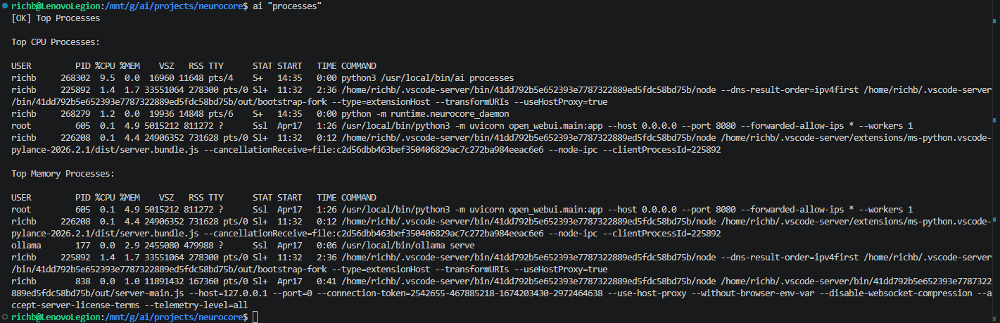
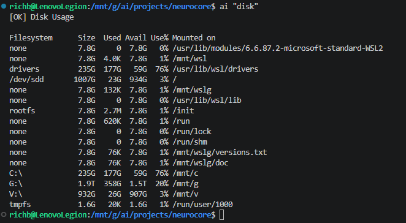
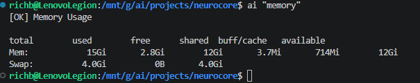
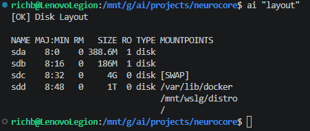
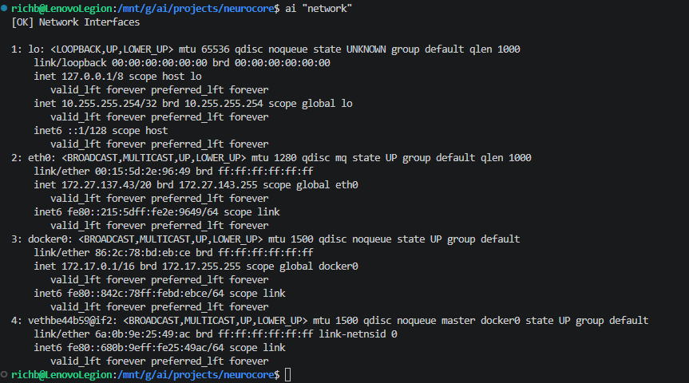
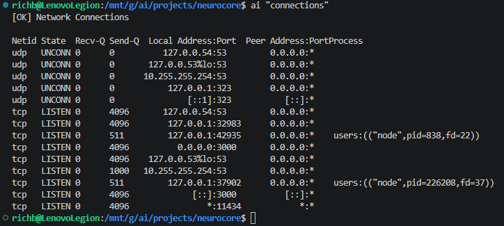
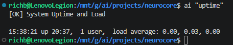
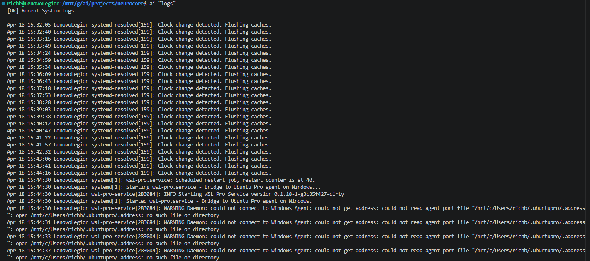
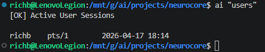
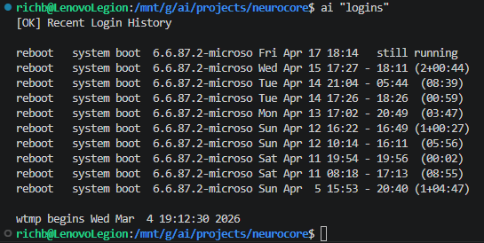

020 – NeuroCore System Tool Expansion

## Summary

This phase is focused on expanding NeuroCore’s execution layer with real, read-only system tools that Argus will eventually use for reasoning.

The goal here is not intelligence yet — just capability.

We are building out a reliable set of tools that can:

- safely execute system commands
- return consistent, readable output
- flow cleanly through the control plane and execution engine

Each tool is being built, tested, fixed, and documented immediately so the pattern stays tight and repeatable.

---

## process_top

### What this tool is for

This tool shows the processes using the most CPU and memory.

The idea is simple:

If a system is slow, this is one of the first things you check.

Later on, Argus will use this to figure out what’s actually causing load on the system.

---

### What I did

- Created:
  tools/system/process_top.py

- Used:
  - ps aux --sort=-%cpu
  - ps aux --sort=-%mem

- Built output to show:
  - top CPU processes
  - top memory processes

- Registered the tool in:
  tools/__init__.py

- Added control plane support:
  - added "processes" keyword
  - mapped it to process_top

---

### First test (did not work)

Command:

ai "processes"

Result:

System just passed the input through. Tool didn’t run.

That told me right away:

Control plane wasn’t recognizing this as an execution request.

---

### Fix

- Added "processes" to execution keywords
- Added routing:
  processes → process_top

---

### Second test (worked, but not clean)

Command:

ai "processes"

This time the tool executed correctly, but the output had this:

- "Top CPU Usage"
- "Top Memory Usage"

That didn’t match what the tool is actually doing (it’s showing processes, not usage summaries).

---

### Fix (formatting)

Updated labels to:

- Top CPU Processes
- Top Memory Processes

Restarted daemon so the change would actually apply.

---

### Final test (clean)

Command:

ai "processes"

Now everything looks right:

- tool runs correctly
- output is clean and consistent
- labels match intent
- control plane routing is working

---

### What this tool gives us now

- quick view of CPU-heavy processes
- quick view of memory-heavy processes
- clean output that Argus can work with later

---

### Notes

- CommandRunner is working exactly how it should
- control plane mapping is required for every new tool
- daemon restart is required for changes (no hot reload)
- output formatting belongs in the tool, not the CLI

This is now the reference pattern for building the rest of the tools in this phase.

---

---

## disk_usage

### What this tool is for

This tool shows disk usage across the system.

Simple idea:

If something starts failing or acting weird, disk space is one of the first things to check.

Later, Argus will use this to detect:

- full disks
- low space conditions
- abnormal usage patterns

---

### What I did

- Created:
  tools/system/disk_usage.py

- Used:
  - df -h

- Output shows:
  - filesystem
  - size
  - used
  - available
  - mount point

- Registered the tool in:
  tools/__init__.py

- Extended control plane:
  - added "disk" keyword
  - mapped it to disk_usage

---

### Test (worked first try)

Command:

ai "disk"

Result:

Tool executed correctly on first run.

- control plane routed correctly
- execution engine ran tool
- output came back clean
- formatting consistent with other tools

---

### Observations (WSL environment)

The output includes a lot of entries like:

- "none"
- WSL-related mount points:
  - /mnt/wsl
  - /mnt/wslg
  - /usr/lib/wsl
  - Windows drives (C:\, G:\, V:\)

This is expected because the system is running inside WSL.

So what we’re seeing is not just “Linux disks” — it’s a mix of:

- virtual mounts
- WSL system layers
- Windows-mounted drives

---

### Important note for later

Right now, we are not filtering or modifying this output.

We are keeping it raw on purpose.

Later, Argus will need to:

- recognize environment type (WSL vs native Linux vs server)
- understand which mounts matter
- ignore noise (like temporary mounts)
- focus on relevant storage signals

So this output is correct for now—it just needs interpretation later.

---

### What this tool gives us now

- full view of disk usage
- visibility into mounted filesystems
- baseline storage signal for Argus

---

### Notes

- CommandRunner worked as expected
- no control plane issues this time
- no formatting issues
- consistent output pattern with other tools

This tool followed the same pattern as process_top with no surprises.

---

---

## memory_usage

### What this tool is for

This tool shows current system memory usage.

Same idea as the other tools in this phase—simple, focused signal.

If something is slow or behaving weird, memory is one of the first things to check.

Later, Argus will use this to understand:

- how much RAM is actually being used
- whether the system is under memory pressure
- whether swap is being used

---

### What I did

- Created:
  tools/system/memory_usage.py

- Used:
  - free -h

- Output shows:
  - total memory
  - used
  - free
  - shared
  - buff/cache
  - available
  - swap usage

- Registered the tool in:
  tools/__init__.py

- Extended control plane:
  - added "memory" keyword
  - mapped it to memory_usage

---

### Test (worked first try)

Command:

ai "memory"

Result:

Tool executed correctly on first run.

- control plane routing worked
- execution engine ran tool
- output came back clean
- formatting consistent with other tools

---

### Observations

The output includes:

- "used"
- "free"
- "buff/cache"
- "available"

Important detail:

Linux memory reporting can be misleading if you don’t know what you’re looking at.

For example:

- "used" does NOT mean all memory is actually unavailable
- "available" is a better indicator of usable memory

---

### Important note for later

Right now, we are returning raw output.

We are not interpreting it.

Later, Argus will need to:

- understand the difference between used vs available memory
- detect real memory pressure (not just high usage)
- identify when swap usage becomes a problem

So just like disk_usage, we keep the output raw and let intelligence happen later.

---

### What this tool gives us now

- clear snapshot of system memory
- visibility into RAM vs swap
- consistent signal for future reasoning

---

### Notes

- CommandRunner worked without issues
- no control plane problems
- no formatting issues
- tool followed the exact same pattern as disk_usage

This confirms the pattern is stable and repeatable.

---

---

## disk_layout

### What this tool is for

This tool shows how disks and partitions are laid out on the system.

Difference from disk_usage:

- disk_usage → how full things are  
- disk_layout → how things are structured  

This helps answer:

- what disks exist  
- how they are partitioned  
- where they are mounted  

Later, Argus will use this to understand how the system is organized before making any decisions about storage.

---

### What I did

- Created:
  tools/system/disk_layout.py

- Used:
  - lsblk

- Output shows:
  - disk devices
  - partitions
  - mount points
  - relationships between them

- Registered the tool in:
  tools/__init__.py

- Extended control plane:
  - added "layout" keyword
  - mapped it to disk_layout

---

### Test (worked first try)

Command:

ai "layout"

Result:

Tool executed correctly on first run.

- control plane routed correctly
- execution engine ran tool
- output came back clean
- formatting consistent with other tools

---

### Observations (WSL environment)

The output shows devices like:

- sda, sdb, sdc, sdd

And includes things like:

- swap disk (sdc)
- main filesystem disk (sdd)

Also noticed:

One disk can have multiple mount points, for example:

- /var/lib/docker  
- /mnt/wslg/distro  
- /

This is expected in WSL because:

- there are multiple layers (Linux + Windows integration)
- some mounts are virtual or system-managed

---

### Important note for later

Right now, we are returning raw output.

We are not interpreting it.

Later, Argus will need to:

- understand disk relationships (disk → partition → mount)
- recognize important vs unimportant mounts
- handle multi-mount scenarios correctly
- adapt behavior based on environment (WSL vs native Linux vs server)

So just like the other tools, we keep this raw for now.

---

### What this tool gives us now

- visibility into disk structure
- understanding of mount relationships
- baseline system layout signal for Argus

---

### Notes

- CommandRunner worked as expected
- no control plane issues
- no formatting issues
- consistent pattern with previous tools

This tool pairs with disk_usage and completes the basic storage view.

---

---

## network_interfaces

### What this tool is for

This tool shows the system’s network interfaces and their assigned IP addresses.

Same idea as the other tools—simple, focused signal.

This helps answer:

- what network interfaces exist  
- which ones are active  
- what IP addresses are assigned  

Later, Argus will use this to understand how the system is connected to the network.

---

### What I did

- Created:
  tools/system/network_interfaces.py

- Used:
  - ip addr

- Output shows:
  - interface names
  - state (UP / DOWN)
  - MAC addresses
  - IPv4 and IPv6 addresses

- Registered the tool in:
  tools/__init__.py

- Extended control plane:
  - added "network" keyword
  - mapped it to network_interfaces

---

### Test (worked first try)

Command:

ai "network"

Result:

Tool executed correctly on first run.

- control plane routed correctly
- execution engine ran tool
- output came back clean
- formatting consistent with other tools

---

### Observations (WSL + Docker environment)

The output includes:

- loopback interface:
  - lo

- primary interface:
  - eth0 (WSL network)

- Docker bridge:
  - docker0

- virtual interfaces:
  - veth... (container networking)

This is expected because the system is running:

- inside WSL
- with Docker installed

---

### Important details

- eth0 shows a 172.x.x.x address  
  → this is a WSL virtual network, not the physical LAN IP

- docker0 represents the Docker network bridge

- veth interfaces are temporary container links  
  → these will change frequently and add noise

---

### Important note for later

Right now, we are returning raw output.

We are not filtering or interpreting anything.

Later, Argus will need to:

- identify the primary interface
- ignore temporary interfaces (veth)
- understand Docker networking vs host networking
- recognize environment type (WSL vs real system)

So just like the other tools, this stays raw for now.

---

### What this tool gives us now

- visibility into network interfaces
- awareness of IP addresses
- baseline network signal for Argus

---

### Notes

- CommandRunner worked without issues
- no control plane issues
- no formatting issues
- tool followed the same pattern as previous tools

This expands the system from local diagnostics into network awareness.

---

---

## network_connections

### What this tool is for

This tool shows active network connections and listening ports on the system.

This is different from the previous network tool:

- network_interfaces → what exists  
- network_connections → what is actively happening  

This helps answer:

- what ports are open  
- what services are listening  
- what processes are bound to network activity  

Later, Argus will use this to understand real network behavior, not just configuration.

---

### What I did

- Created:
  tools/system/network_connections.py

- Used:
  - ss -tulnp

- Output shows:
  - TCP and UDP connections
  - listening ports
  - local addresses and ports
  - process information (when available)

- Registered the tool in:
  tools/__init__.py

- Extended control plane:
  - added "connections" keyword
  - mapped it to network_connections

---

### Test (worked first try)

Command:

ai "connections"

Result:

Tool executed correctly on first run.

- control plane routed correctly
- execution engine ran tool
- output came back clean
- formatting consistent with other tools

---

### Observations

The output includes both:

- UDP (connectionless services)
- TCP (listening services)

Common things observed:

- DNS-related ports (53)
- system services (loopback)
- application ports (3000, 11434, etc.)

Also includes process information in some cases:

users:(("node",pid=...,fd=...))

---

### Important details

- LISTEN state shows services waiting for connections  
- UDP entries show background services (like DNS, time sync)  
- some entries do not show process info (expected in certain cases)

Ports like:

- 3000 → Open WebUI  
- 11434 → Ollama  

These confirm that real services are exposed and detectable.

---

### Important note for later

Right now, we are returning raw output.

We are not interpreting anything.

Later, Argus will need to:

- identify important vs unimportant ports  
- detect unexpected exposed services  
- map ports to known applications  
- flag potential security concerns  
- understand environment context (WSL, Docker, etc.)

So like the other tools, this stays raw for now.

---

### What this tool gives us now

- visibility into active network behavior  
- awareness of open ports  
- ability to see which processes are listening  

---

### Notes

- CommandRunner worked without issues
- no control plane issues
- no formatting issues
- tool followed the same pattern as previous tools

This is the first tool that shows live system activity instead of just system state.

---

---

## uptime_load

### What this tool is for

This tool shows system uptime and load averages.

This is more of a high-level signal compared to the other tools.

Instead of looking at individual components (CPU, memory, disk), this gives a quick snapshot of overall system activity.

This helps answer:

- how long the system has been running  
- how busy the system is overall  

Later, Argus will use this to quickly determine if the system is under load or mostly idle.

---

### What I did

- Created:
  tools/system/uptime_load.py

- Used:
  - uptime

- Output shows:
  - current time
  - system uptime
  - number of users
  - load averages (1, 5, 15 minute)

- Registered the tool in:
  tools/__init__.py

- Extended control plane:
  - added "uptime" keyword
  - mapped it to uptime_load

---

### Test (worked first try)

Command:

ai "uptime"

Result:

Tool executed correctly on first run.

- control plane routed correctly
- execution engine ran tool
- output came back clean
- formatting consistent with other tools

---

### Observations

The output includes:

- uptime (how long system has been running)
- number of users
- load averages over:
  - 1 minute
  - 5 minutes
  - 15 minutes

Example:

load average: 0.00, 0.03, 0.00

This indicates the system is mostly idle.

---

### Important details

Load average does NOT equal CPU usage.

It represents:

- how many processes are waiting for CPU time

So:

- low numbers → system is idle  
- high numbers → system is under load  

---

### Important note for later

Right now, we are returning raw output.

We are not interpreting it.

Later, Argus will need to:

- compare load against system capacity (CPU cores)
- detect abnormal load conditions
- correlate load with CPU, memory, and process data

So like the other tools, this remains raw for now.

---

### What this tool gives us now

- quick system health snapshot  
- visibility into system activity level  
- baseline signal for system load  

---

### Notes

- CommandRunner worked without issues
- no control plane issues
- no formatting issues
- tool followed the same pattern as previous tools

This adds a system-level health indicator to the toolset.

---

---

## system_logs

### What this tool is for

This tool shows recent system log entries.

This is a big one for real-world troubleshooting.

Logs are usually the first place admins go when something isn’t working right.

This helps answer:

- what just happened on the system  
- what errors or warnings are occurring  
- what services are doing in real time  

Later, Argus will use this as one of its primary sources for detecting and explaining issues.

---

### What I did

- Created:
  tools/system/system_logs.py

- Used:
  - journalctl -n 50 --no-pager

- Output shows:
  - recent system log entries
  - service messages
  - warnings and errors

- Registered the tool in:
  tools/__init__.py

- Extended control plane:
  - added "logs" keyword
  - mapped it to system_logs

---

### Test (worked first try)

Command:

ai "logs"

Result:

Tool executed correctly on first run.

- control plane routed correctly
- execution engine ran tool
- output came back clean
- formatting consistent with other tools

---

### Observations (WSL environment)

The output includes repeated entries like:

- systemd-resolved: Clock change detected. Flushing caches

Also includes warnings like:

- wsl-pro-service: could not connect to Windows Agent
- missing file under /mnt/c/Users/...

This is expected because the system is running in WSL.

---

### Important details

- repeated "clock change" messages are related to time sync between Windows and WSL  
- wsl-pro-service warnings indicate optional Ubuntu Pro integration not fully configured  
- these are not critical errors, just environment noise  

This is a good example of how logs can look noisy even when nothing is actually broken.

---

### Important note for later

Right now, we are returning raw logs.

We are not filtering or interpreting anything.

Later, Argus will need to:

- identify real errors vs harmless noise  
- detect repeated patterns  
- correlate log events with system behavior  
- explain issues in plain language  

Logs will become one of the highest-value signals in the system.

---

### What this tool gives us now

- visibility into recent system events  
- access to warnings and errors  
- raw data for troubleshooting  

---

### Notes

- CommandRunner worked without issues
- no control plane issues
- no formatting issues
- tool followed the same pattern as previous tools

This is one of the most valuable tools in the entire set.

---

---

## users_sessions

### What this tool is for

This tool shows currently logged-in users on the system.

This is a simple but important signal.

It helps answer:

- who is currently logged in  
- how many active sessions exist  
- when users logged in  

Later, Argus will use this to detect:

- unexpected logins  
- multiple sessions  
- potential security concerns  

---

### What I did

- Created:
  tools/system/users_sessions.py

- Used:
  - who

- Output shows:
  - username
  - terminal session (pts)
  - login time

- Registered the tool in:
  tools/__init__.py

- Extended control plane:
  - added "users" keyword
  - mapped it to users_sessions

---

### Test (worked first try)

Command:

ai "users"

Result:

Tool executed correctly on first run.

- control plane routed correctly
- execution engine ran tool
- output came back clean
- formatting consistent with other tools

---

### Observations (WSL environment)

The output shows a single user session:

- richb → pts/1

This is expected in WSL because:

- typically only one interactive user session exists  
- no SSH or multi-user access by default  

---

### Important note for later

Right now, this is a simple snapshot.

Later, Argus will need to:

- detect multiple sessions  
- identify remote logins  
- correlate sessions with activity  

---

### What this tool gives us now

- visibility into active users  
- awareness of session activity  
- baseline user signal  

---

### Notes

- CommandRunner worked without issues
- no control plane issues
- no formatting issues
- tool followed the same pattern as previous tools

This completes the basic user visibility layer.

---

---

## recent_logins

### What this tool is for

This tool shows recent login history on the system.

This is basically the historical version of the users tool.

Where users_sessions shows who is logged in right now, this shows who has logged in over time.

This helps answer:

- who accessed the system recently  
- when the system was used  
- how long sessions lasted  

Later, Argus will use this to detect patterns like:

- repeated logins  
- unusual access times  
- potential unauthorized access  

---

### What I did

- Created:
  tools/system/recent_logins.py

- Used:
  - last -n 10

- Output shows:
  - user or system event  
  - terminal/session type  
  - login time  
  - session duration  

- Registered the tool in:
  tools/__init__.py

- Extended control plane:
  - added "logins" keyword
  - mapped it to recent_logins

---

### Test (worked after control plane fix)

Command:

ai "logins"

Result:

Tool executed correctly after fixing the control plane.

- control plane routing works correctly
- execution engine runs tool properly
- output is clean and readable

---

### Observations (WSL environment)

At first glance, the output might look confusing because it mostly shows entries like:

- reboot   system boot

Instead of actual user logins.

This is expected in WSL.

---

### What the output actually means

Each line like:

reboot   system boot  ...

represents:

- a system start event  
- when the WSL environment was launched  
- how long it stayed active  

For example:

- "still running" → current session  
- "(03:47)" → how long that session lasted  

So in this environment, the tool is effectively showing:

- when the system was used  
- how long it was active  

---

### Why we don’t see normal user logins

In a typical Linux server, this tool would show:

- SSH logins  
- console logins  
- multiple users  

But in WSL:

- there is no traditional login process  
- sessions are tied to the Windows environment  
- so only system boot events are recorded  

---

### Important note for later

Right now, we return raw output exactly as the system provides it.

Later, Argus will need to:

- recognize environment type (WSL vs real server)  
- interpret reboot entries as session activity  
- distinguish real user logins vs system events  
- explain this clearly to the user  

---

### What this tool gives us now

- visibility into system usage over time  
- awareness of session durations  
- historical activity signal  

---

### Notes

- tool worked correctly after fixing control plane issue  
- no execution issues after fix  
- output is accurate for the environment  
- follows same pattern as previous tools  

This complements users_sessions and completes the basic user activity view.